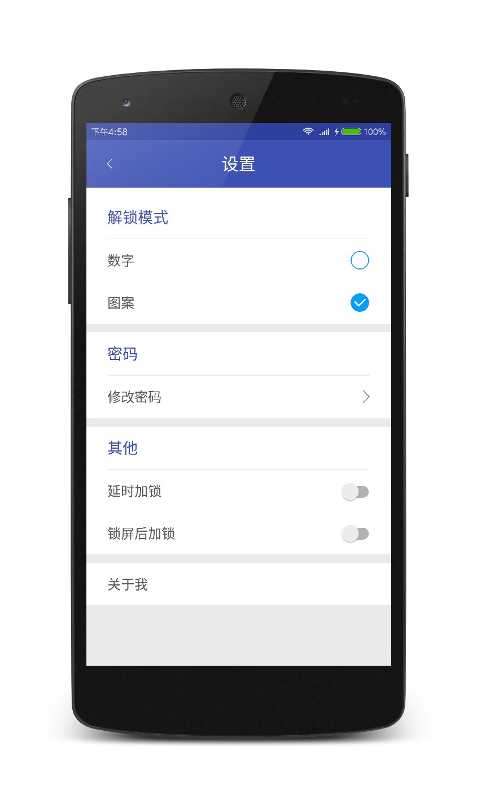
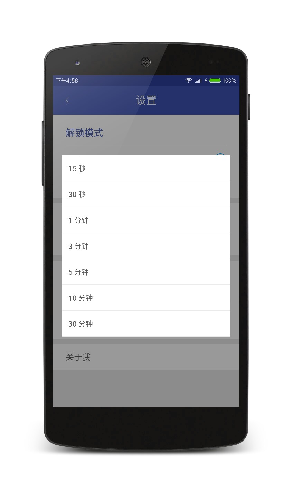
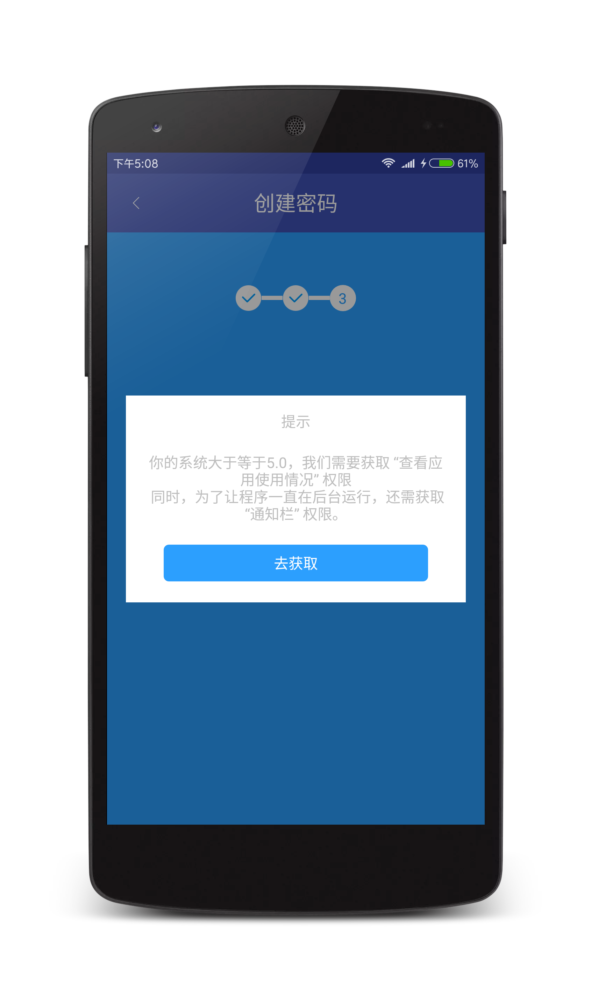

#### AppLock应用锁

保护你的隐私

#### 简介  
AppLock应用锁，保护你的隐私。       
欢迎Start,Fork和Issues。
项目用到的第三方库：litepal     
在5.0以上的系统需要获取 查看应用使用情况 的权限，否则应用锁会失效   
目前项目还很粗糙，之后会一直改进
#### 功能介绍
项目只简单实现了以下功能：
-  第一次进入的应用列表，包含推荐加锁的应用
-  主界面列表，加锁解锁开关以及全选加锁和全选解锁
-  应用加锁
-  应用解锁
-  修改锁密码
-  隐藏和显示解锁路径
-  设置延时加锁和屏幕关闭后加锁以及它们的组合
-  设置不锁某应用

2017-2-28
-  更改设置里清除数据变为管理空间
-  添加了NotificationListenerService
-  更改了图标

#### Apk下载

#### 截图
 

 

 
#### About me
An android developer in GuangZhou  
简书：[http://www.jianshu.com/users/286f9ad9c417/latest_articles](http://www.jianshu.com/users/286f9ad9c417/latest_articles)   
Email:386707112@qq.com  
If you want to make friends with me, You can give me a Email and follow me。

#### License
Copyright 2017 L_Xian

Licensed under the Apache License, Version 2.0 (the "License"); you may not use this file except in compliance with the License. You may obtain a copy of the License at

http://www.apache.org/licenses/LICENSE-2.0

Unless required by applicable law or agreed to in writing, software distributed under the License is distributed on an "AS IS" BASIS, WITHOUT WARRANTIES OR CONDITIONS OF ANY KIND, either express or implied. See the License for the specific language governing permissions and limitations under the License.
