#### AppLock应用锁

保护你的隐私


由于个人精力有限和因为比较懒，本来重构着的项目突然不想动了，所以写了一点优化建议来代替，如下：

[项目优化建议](https://github.com/lizixian18/AppLock/blob/master/项目优化建议.md)

内容主要是应用锁服务还有解锁界面，数据操作，进程保活等六点小建议。  

<br><br><br><br>


#### 简介  
AppLock应用锁，保护你的隐私。       
欢迎Start,Fork和Issues。
项目用到的第三方库：litepal     
在5.0以上的系统需要获取 查看应用使用情况 的权限，否则应用锁会失效   
若有好的建议例如实现方案，界面，功能等欢迎提出。

 

目前问题：
-  进程的保活还没实现好
-  项目中的代码结构逻辑没完善好，还存在一些bug。

附：
在github上看到一个判断应用在前后台的方法，非常牛逼，可以替换项目中原来的方法来实现，推荐一波。
地址：
https://github.com/wenmingvs/AndroidProcess


#### Apk下载
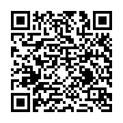

#### 截图
<a href="art/1.png">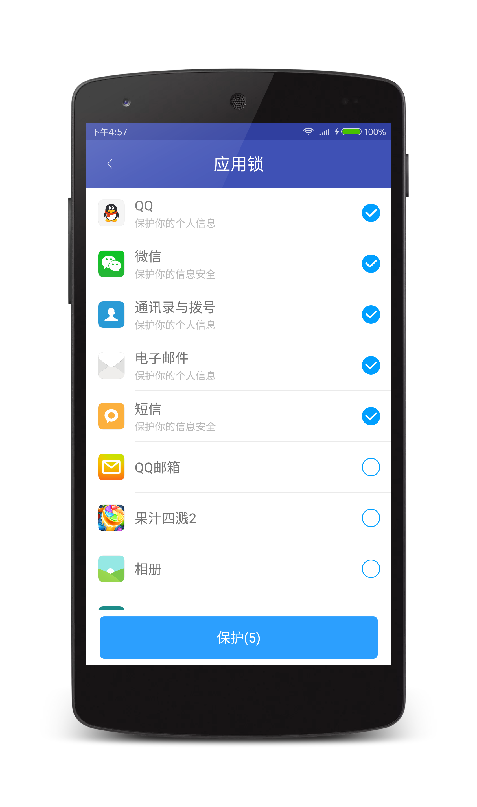</a>
<a href="art/2.png">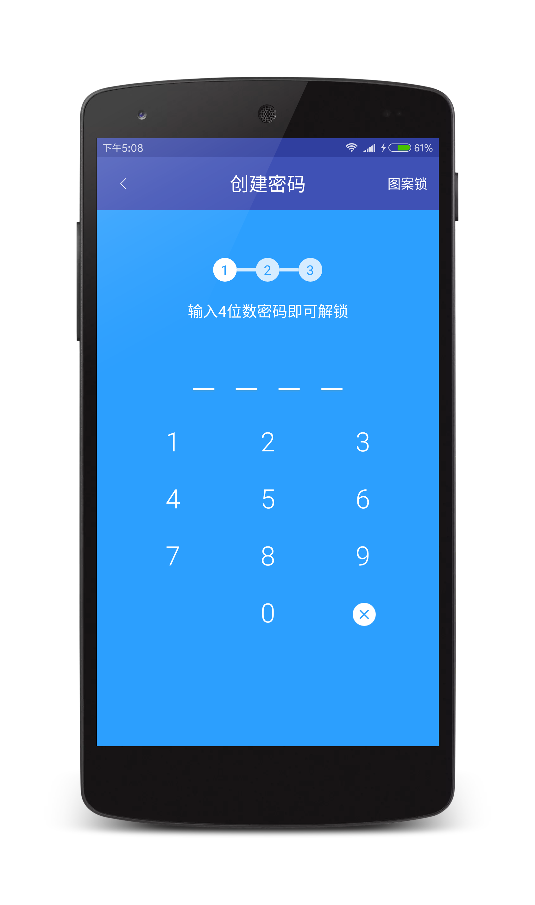</a>
<a href="art/3.png">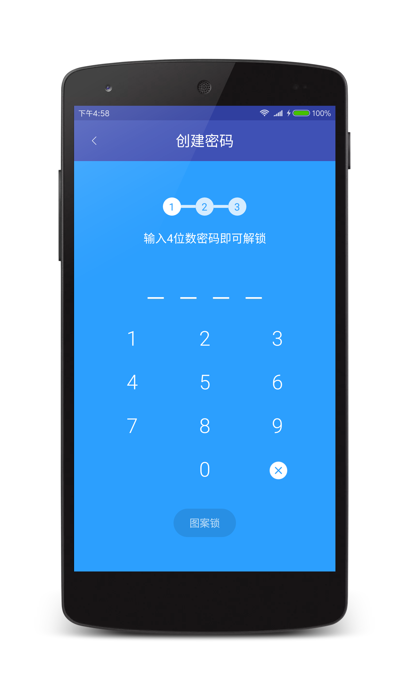</a>

<a href="art/4.png">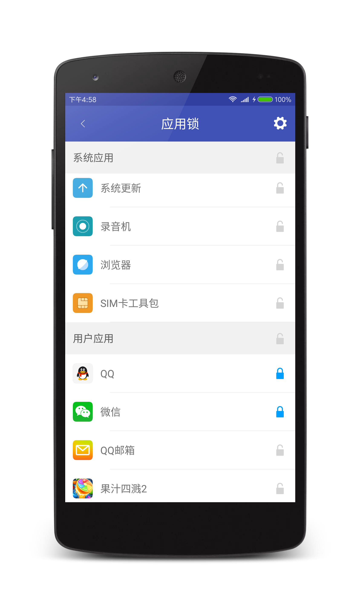</a>
<a href="art/5.png">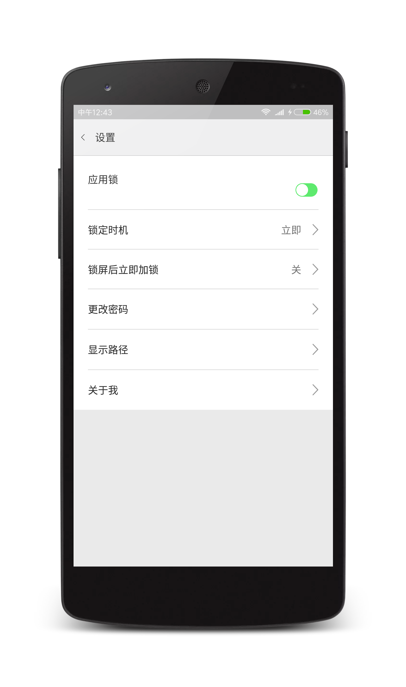</a>
<a href="art/6.png">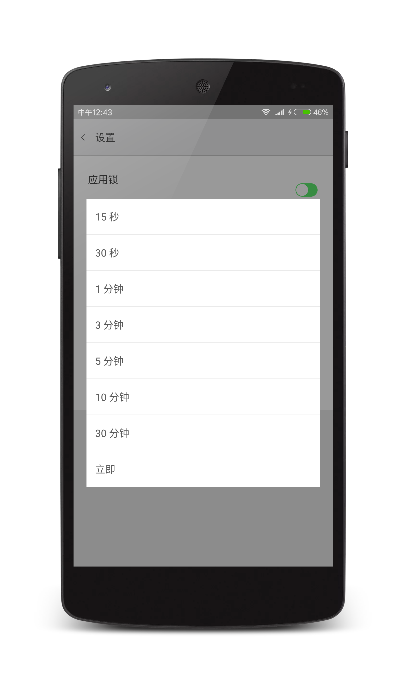</a>

<a href="art/7.png">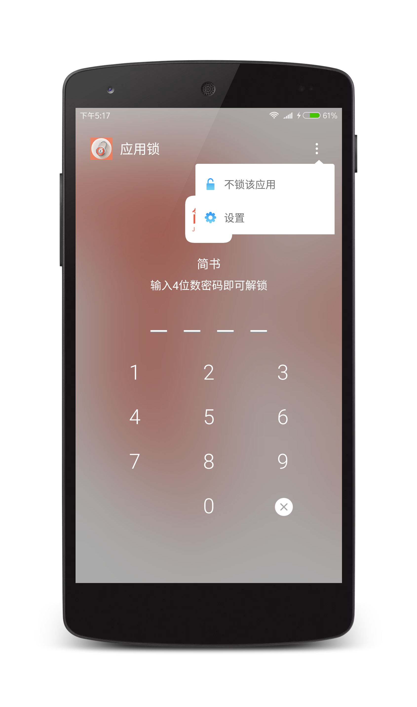</a>
<a href="art/8.png">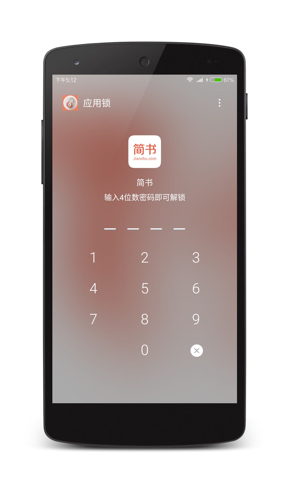</a>
<a href="art/9.png">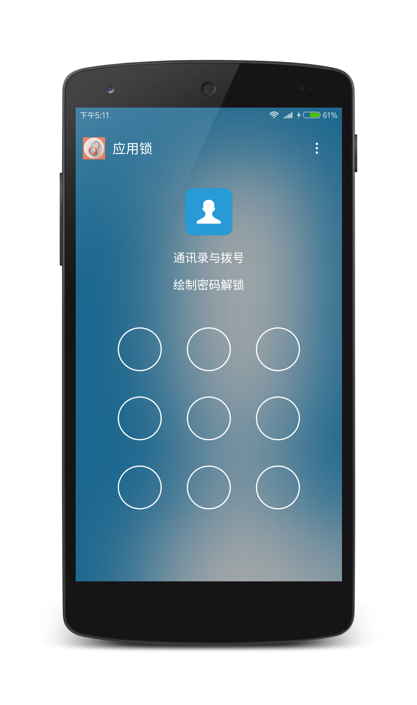</a>

<a href="art/10.png">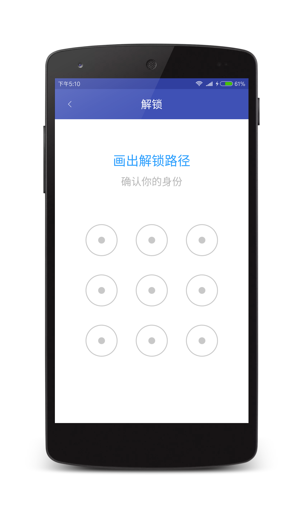</a>
<a href="art/11.png">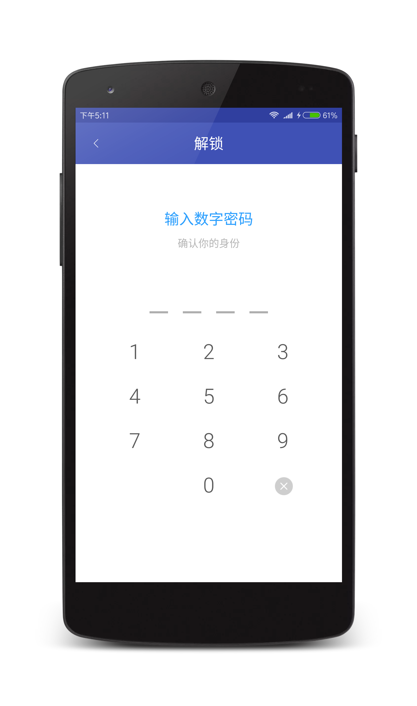</a>

#### About me
An android developer in GuangZhou  
简书：[http://www.jianshu.com/users/286f9ad9c417/latest_articles](http://www.jianshu.com/users/286f9ad9c417/latest_articles)   
Email:386707112@qq.com  
If you want to make friends with me, You can give me a Email and follow me。

#### License
```
Copyright 2017 L_Xian   
 
Licensed under the Apache License, Version 2.0 (the "License");  
you may not use this file except in compliance with the License.  
You may obtain a copy of the License at  

http://www.apache.org/licenses/LICENSE-2.0  

Unless required by applicable law or agreed to in writing, software  
distributed under the License is distributed on an "AS IS" BASIS,  
WITHOUT WARRANTIES OR CONDITIONS OF ANY KIND, either express or implied.  
See the License for the specific language governing permissions and  
limitations under the License.
```
```
